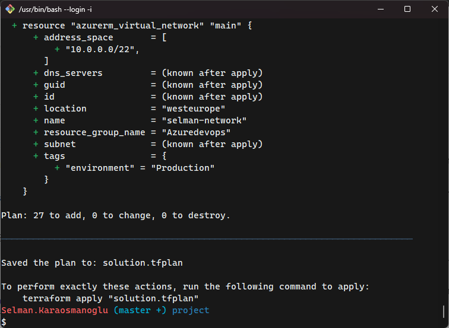

By Selman Karaosmanoglu 

## Date created
30 March 2024

# Azure Infrastructure Operations Project: Deploy a scalable IaaS web server on Azure

## Introduction
This is a project that utilizes Packer and Terraform to deploy a customisable, scalable web server on Azure.

## Overview
### First Part: Azure Policy
Deploying an Azure policy on Azure that restricts the creation of resources unless they have a tag.

### Second Part: Deploy an Image with Packer
Deploying a server template on Azure with Packer.

 It configures the following:  
- The base image, which is Ubuntu 18.04 LTS
- Provisioning, which creates index.html and runs busybox.

The output will be stored in a managed image named PackerImage within the resource group.

### Third Part: Provision Resources on Azure
Provisioning following resources on Azure via Terraform. 
- **Resource group** (as a reference): A logical container for resources deployed on Azure.
- **Virtual Network**: A private network in Azure that allows you to securely connect Azure resources.
- **Subnet**: A subdivision of a virtual network that allows you to segment resources.
- **Network Security Group**: A firewall that filters network traffic to and from Azure resources.
- **Network Interface**: A virtual network interface card (NIC) attached to a virtual machine.
- **Network Interface Security Group Association**: Associates a network security group with a network interface. 
- **Public IP**: A public IP address that allows resources to communicate over the internet.
- **Load Balancer**: Distributes incoming network traffic across multiple resources.
- **Load Balancer Probe**: Monitors the health of resources behind a load balancer.
- **Backend Address Pool**: A collection of IP addresses for load-balanced resources.
- **Load Balancer Rule**: Defines how traffic is distributed to backend resources.
- **Network Interface Backend Adress Pool Association**: Associates a network interface with a backend address pool.
- **Availability Set**: Ensures high availability by distributing VMs across fault domains and update domains.
- **Managed Disk**: A block-level storage volume that is managed by Azure and used with Azure Virtual Machines.
- **Packer Image** (as a reference): A custom image created using HashiCorp Packer.
- **Linux Virtual Machine**: A virtual machine running a Linux operating system.
- **Virtual Machine Data Disk Attacehement**: Attaches a data disk to a virtual machine.

The main configuration file -**main.tf**- is flexible. This means that it can be customised by defining values in **variables.tf**. In this way it is possible to configure the number of virtual machines on Azure.

## Requirements
1. Install the [Azure command line interface](https://docs.microsoft.com/en-us/cli/azure/install-azure-cli?view=azure-cli-latest)
2. Install [Packer](https://www.packer.io/downloads)
3. Install [Terraform](https://www.terraform.io/downloads.html)

## Instructions

First authenticate and establish a session with Azure.
```
az login
```


### 1. Deploy the policy
#### 1.1 Create a policy definition for tagging
```
az policy definition create --name "tagging-policy" --display-name "Tagging Policy" --description "Ensure all indexed resources have tags" --rules deny-policy.json
```


#### 1.2 Assign the policy definition
```
az policy assignment create --name "tagging-policy-assignment" --display-name "Tagging Policy Assignment" --policy "tagging-policy"
```


### 2. Create a machine image with Packer on Azure
Build the image using packer. 

A resource group and service principal required to execute the command. To reproduce the command below, change the following fields in packer-server.json accordingly:
- **managed_image_resource_group_name** (The resource group name on Azure)
- **client_id** (Application ID from the Service Principal)
- **client_secret** (Client Secret from the Service Principal)
- **subscription_id** (Azure Subscription ID)

```
packer build packer-server.json
```


### 3. Provision Resources on Azure using Terraform
#### 3.1 Initialize a new Terraform configuration
```
terraform init
```


#### 3.2 Variables of Terraform configuration
The **variables.tf** file is the central location for defining input variables for the Terraform configuration. The variables in this file are as follows:

- **prefix**: This variable specifies the prefix to be used for all resources in the example. This value needs to be specified during deployment.

- **location**: The Azure Region where all resources in this example should be created. The default value is “westeurope.”

- **number_of_vms**: Indicates the number of virtual machines (VMs) to be deployed. The default value is 3.

- **admin_username**: The admin username for the VMs being created. This value needs to be specified during deployment.

- **admin_password**: The password for the VMs. Similar to the username, this value must be provided during deployment.

- **image**: Specifies the VM image to deploy. The default value is “PackerImage.”

- **environment**: A tag representing the environment (e.g., “Production”).

Customize these variables in **variables.tf** according to your specific requirements. 

#### 3.3 Generate Terraform plan

```
terraform plan -out solution.tfplan
```



#### 3.4 Apply Terraform plan

```
terraform apply solution.tfplan
```


#### 3.5 Destroy Terraform
Destroy when no longer needed.
```
terraform destroy
```


## Alternative way
Alternatively, you can also follow the jupyter notebooks below which consist of shell commands for each part. It can be run via VSCode or Jupyter Lab:

**1-policy-definition-assignment.ipynb** (for Azure policy) 

**2-packer.ipynb** (for Packer)

**3-terraform.ipynb** (for Terraform)

## Credits

This project is part of the Udacity Data Engineer Nanodegree Program.